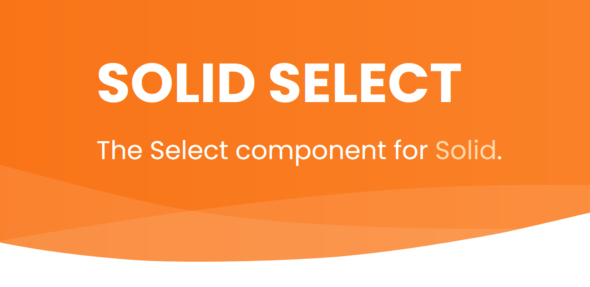

<a href="https://solid-select.com">
    
  </a>

- **Built for [Solid](https://solidjs.com/):** leverages fine-grained reactivity
  primitives for coordination.
- **Flexible:** built to support a wide range of cases, from single selects to
  multi-select autocomplete lists.
- **Extendable:** use the pre-fabricated components or build your own from the
  core primitives.
- **Zero dependencies:** Just pair with Solid and good to go.


## How do I get started? 🧭

Install it:

```bash
npm install @thisbeyond/solid-select
```

Use it:

```jsx
import { Select } from "@thisbeyond/solid-select";
import "@thisbeyond/solid-select/style.css";

const App = () => {
  return (
    <div>
      <Select options={["apple", "banana", "pear", "pineapple", "kiwi"]} />
    </div>
  );
};

export default App;
```

See more examples at https://solid-select.com

## What's implemented? ✔️

- [x] A high level `Select` component that can be configured with either a
  static or dynamic list of options.
- [x] Support for single value selection or multiple value selection.
- [x] `createOptions` helper for configuring filterable options based on input
  value (complete with match highlighting). Works with lists of plain strings or
  can be passed a 'key' to filter against lists of objects. Can also be used to
  configure creating new options on the fly.
- [x] Opt-in sensible default styling. Customise easily or style from scratch.
- [x] Composable building blocks to create your own control.
- [x] Lower level `createSelect` primitive if you just want the core logic.

## Who made this? ✍

[Martin Pengelly-Phillips](https://twitter.com/thesociablenet)

## Why did you make it?

I've been part of the [SolidJS community](https://discord.com/invite/solidjs)
for a while now and one of the things I really like is the emphasis on trying
things out and sharing them (https://hack.solidjs.com). The ecosystem is small
which creates a lot of opportunity and a lower barrier to entry for sharing I
find.

I published my first Solid library (https://solid-dnd.com) a short while back as
a first dabble in sharing what I had learnt on a personal project. That went
well so when I had to create a multi-select autocomplete control for another
personal project I knew I'd be sharing that too - and so `Solid Select` came to
be :)
